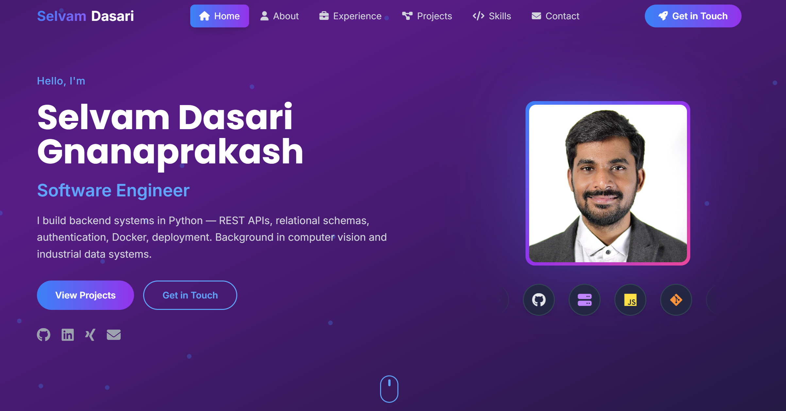

# Portfolio — Selvam Dasari Gnanaprakash

Personal portfolio site. Software engineer working in Python — backend systems, REST APIs, databases, containers.

**Live:** https://selvam-dg.github.io/My_Portfolio/

## Stack

- React 18 + Vite
- TailwindCSS
- Font Awesome
- Deployed to GitHub Pages via `gh-pages`

## Structure

```
src/
├── App.jsx              # layout, scroll spy, back-to-top
├── main.jsx
├── index.css            # Tailwind directives + custom animations
└── components/
    ├── Navbar.jsx       # fixed nav, active-section highlighting, mobile menu
    ├── Hero.jsx         # intro, photo, marquee skill strip
    ├── About.jsx        # background and career summary
    ├── Experience.jsx   # roles, education, certifications
    ├── Projects.jsx     # filterable project grid with expandable details
    ├── Skills.jsx       # technologies grouped by area
    ├── Contact.jsx      # contact form (Web3Forms) and links
    └── Footer.jsx
```

## Running locally

```bash
git clone https://github.com/Selvam-DG/My_Portfolio.git
cd My_Portfolio
npm install
npm run dev
```

The contact form needs a [Web3Forms](https://web3forms.com) access key:

```bash
# .env
VITE_WEB3_ACCESS_KEY=your_access_key
```

Without it the form renders but submissions fail.

## Build and deploy

```bash
npm run build      # output to dist/
npm run preview    # serve the production build locally
npm run deploy     # build and publish to the gh-pages branch
```

`vite.config.js` sets `base: '/My_Portfolio/'` for GitHub Pages. Change this if deploying elsewhere.

## Notes

- Single page with anchor navigation — no router
- Scroll spy in `App.jsx` drives the active nav state; the section id list there must match `navItems` in `Navbar.jsx`
- Animations respect `prefers-reduced-motion`

## Contact

- [LinkedIn](https://www.linkedin.com/in/selvamdasari55/) 
- [GitHub](https://github.com/Selvam-DG) · dasariselvam321@gmail.com




